# Wolt Frontend Best Practices Cheat Sheet

> Based on the "Wolt Frontend Best Practices & How to Nail the Technical Interview" presentation for Hive Helsinki students (January 2026)

---

## 1. What Makes Good Frontend Code?

Five qualities that define good frontend code:

| Quality | Description |
|---------|-------------|
| **Clarity** | Easy to read, easy to explain |
| **Accessible** | Works for everyone, not just mouse + screen users |
| **Predictable** | Behaves the same way every time |
| **Testable** | Important logic can be verified in isolation |
| **Maintainable** | Small changes do not cause surprises |

---

## 2. Accessibility & Semantics (a11y)

> "If it only works with a mouse and perfect vision, it is not finished yet."

### Good Practices

- **Use semantic HTML** (`button`, `label`, `form`, `nav`, `table`)
- **For numeric input**: prefer `input[type="text"]` + `inputmode` instead of `input[type="number"]`
  [read more](https://technology.blog.gov.uk/2020/02/24/why-the-gov-uk-design-system-team-changed-the-input-type-for-numbers/),
  [read more](https://stackoverflow.blog/2022/12/26/why-the-number-input-is-the-worst-input/)
- **Learn and use basic ARIA attributes** for enhanced accessibility
- **Provide clear instructions** for expected input formats (password format)

### Why It Matters

- Screen readers, keyboards, and assistive tech rely on semantics
- Better accessibility usually means better UX for everyone
- **Interviewers notice when you care about this**

### Quick Example

```html
<!-- Bad: div with click handler -->
<div onclick="submit()">Submit</div>

<!-- Good: semantic button -->
<button type="submit">Submit</button>
```

### Input Format Instructions - Examples

| Input Type | Example Instruction |
|------------|---------------------|
| **Password** | "8+ characters, 1 uppercase, 1 number, 1 special character" |
| **Coordinates** | "Latitude, Longitude (e.g., 60.1699, 24.9384)" |
| **Phone number** | "+358 40 123 4567" or "Include country code" |
| **Date** | "DD/MM/YYYY" or show a placeholder like "25/01/2026" |
| **Time** | "HH:MM (24-hour format)" or "e.g., 14:30" |
| **Postal code** | "5 digits" (varies by country) |
| **Credit card** | "16 digits, no spaces" |
| **Currency** | "Amount in EUR (e.g., 12.50)" |
| **File upload** | "PNG or JPG, max 5MB" |
| **Username** | "3-20 characters, letters and numbers only" |
| **URL** | "Include https:// (e.g., https://example.com)" |

### How to Show Format Instructions in HTML

```html
<!-- Using placeholder -->
<input type="text" placeholder="60.1699, 24.9384" />

<!-- Using aria-describedby (best for screen readers!) -->
<label for="coords">Coordinates</label>
<input type="text" id="coords" aria-describedby="coords-hint" />
<small id="coords-hint">Format: latitude, longitude (e.g., 60.1699, 24.9384)</small>

<!-- Using pattern + title for validation hint -->
<input
  type="text"
  pattern="[0-9]{5}"
  title="5 digit postal code"
/>
```

> **Tip**: The `aria-describedby` approach is best for accessibility because screen readers announce the hint when the user focuses the input.

---

## 3. UX, UI & Polish

> "Good UX is about removing friction, not adding decoration."

### Good Practices

- **Loading states**: spinners, skeletons, disabled actions
- **Locale-aware formatting**: numbers, currency, dates using user's locale
- **Theme support**: light and dark mode
- **Visual polish**: spacing, hierarchy, subtle animations
- **Brand colors**: use tastefully, not excessively

### Why It Matters

- Users trust interfaces that feel responsive and consistent
- Clear feedback prevents repeated actions and errors
- Small polish details signal care and professionalism

---

## 4. Separation of Concerns

> "Structure your code so each responsibility is clear and isolated."

### Concerns to Separate

1. Input validation
2. Submit / action logic
3. Communication with APIs
4. Parsing and validating API responses
5. Business logic
6. Output formatting for display

### Simple Frontend Structure

```mermaid
flowchart LR
    subgraph Component["Component"]
        direction TB
        C1["Handles input and rendering"]
        C2["- Reads user input"]
        C3["- Manages UI state"]
        C4["- Renders UI based on data"]
        C5["- No business rules"]
    end

    subgraph Pure["Pure Functions"]
        direction TB
        P1["Calculations & decisions"]
        P2["- No side effects"]
        P3["- Same input → same output"]
        P4["- Easy to test"]
        P5["- Contains business logic"]
    end

    subgraph Service["Service"]
        direction TB
        S1["External communication"]
        S2["- API calls"]
        S3["- Data fetching"]
        S4["- Error handling"]
        S5["- No UI logic"]
    end

    Component --> Pure
    Pure --> Service

    style Component stroke:#00c2e8,stroke-width:2px
    style Pure stroke:#00c2e8,stroke-width:2px
    style Service stroke:#00c2e8,stroke-width:2px
```



### Examples by Layer

| Layer | Examples |
|-------|----------|
| **Pure Functions** | `isEmailValid(email)`, `calculateTotal(items)` |
| **Service** | `fetchUsers()`, `submitForm(data)`, `loadProfile(id)` |

---

## 5. Testing

> "Testing is easier when your code is structured well."

### Good Practices

- Prefer testing **small, pure functions**
- Focus tests on **business logic** and **data parsing**
- Test **edge cases** and **invalid inputs**
- Keep tests **fast and deterministic**

### What to Avoid

- Large tests that require rendering everything
- Heavy mocking of UI and network layers
- Testing implementation details instead of behavior

### Why It Matters

- Tests give confidence to refactor
- Failures are easier to understand and fix
- **Interviewers care more about *what* you test than the testing library**

---

### Bad Example: Big Function with Heavy Mocking

This approach makes it hard to know where failures occur:

```typescript
// The function does too much
async function processOrder(orderId: string) {
  const response = await fetch(`/api/orders/${orderId}`)
  const order = await response.json()

  let total = 0
  for (const item of order.items) {
    total += item.price * item.quantity
  }

  if (order.discountCode === "SAVE10") {
    total = total * 0.9
  }

  if (order.country === "IT") {
    total = total * 1.22
  }

  return Math.round(total * 100) / 100
}
```

```typescript
// Test requires heavy mocking
global.fetch = vi.fn(() =>
  Promise.resolve({
    json: () =>
      Promise.resolve({
        items: [{ price: 10, quantity: 2 }],
        discountCode: "SAVE10",
        country: "IT",
      }),
  } as any)
)

it("calculates total price", async () => {
  const total = await processOrder("123")
  expect(total).toBe(21.96)
})
```

**Problem**: If the test fails, we don't know which part broke.

---

### Good Example: Small Single-Responsibility Functions

```typescript
type Order = {
  items: { price: number; quantity: number }[]
  discountCode?: string
  country: string
}

function calculateSubtotal(items: Order["items"]) {
  return items.reduce(
    (sum, item) => sum + item.price * item.quantity,
    0
  )
}

function applyDiscount(total: number, code?: string) {
  return code === "SAVE10" ? total * 0.9 : total
}

function applyTax(total: number, country: string) {
  if (country === "IT") return total * 1.22
  return total
}

function roundMoney(amount: number) {
  return Math.round(amount * 100) / 100
}
```

```typescript
// Clean, focused tests - no mocking needed!

it("applies Italian tax", () => {
  expect(applyTax(10, "IT")).toBe(12.2)
})

it("applies discount", () => {
  expect(applyDiscount(100, "SAVE10")).toBe(90)
})

it("calculates subtotal", () => {
  expect(
    calculateSubtotal([{ price: 5, quantity: 2 }])
  ).toBe(10)
})
```

**Benefit**: If something goes wrong, we know exactly where.

---

## Quick Reference Summary

| Topic | Key Takeaway |
|-------|--------------|
| **Good Code** | Clarity, Accessible, Predictable, Testable, Maintainable |
| **Accessibility** | Use semantic HTML, ARIA, keyboard support |
| **UX/Polish** | Loading states, locale formatting, theme support |
| **Separation** | Component → Pure Functions → Service |
| **Testing** | Small pure functions, no heavy mocking, test behavior |

---

## Interview Tips

1. **Show you care about accessibility** - it stands out
2. **Explain your separation of concerns** - interviewers love clean architecture
3. **Write testable code** - what you test matters more than the library
4. **Think about edge cases** - invalid inputs, loading states, errors
5. **Keep it simple** - don't over-engineer

---

*Created by Amedeo Majer - Hive Helsinki Hiver 3, Junior Web Developer at Wolt*
